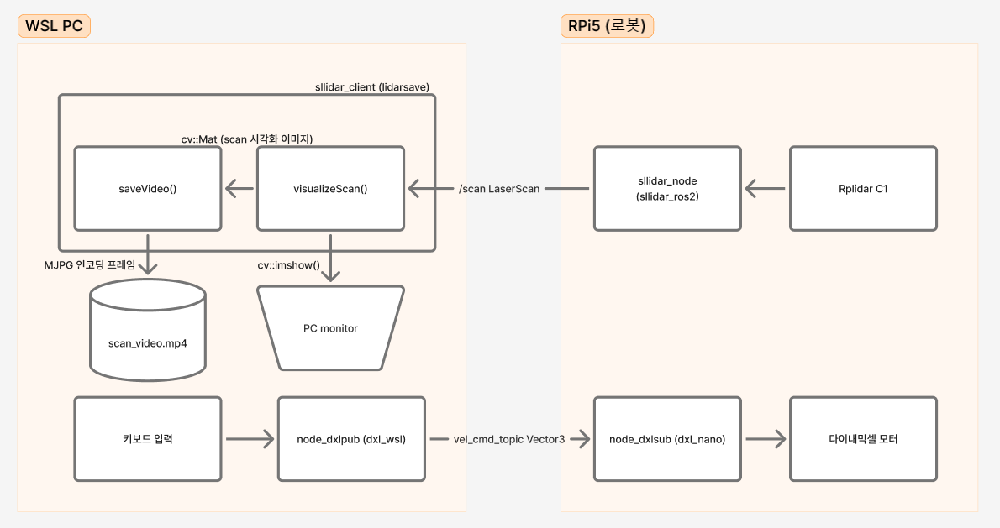
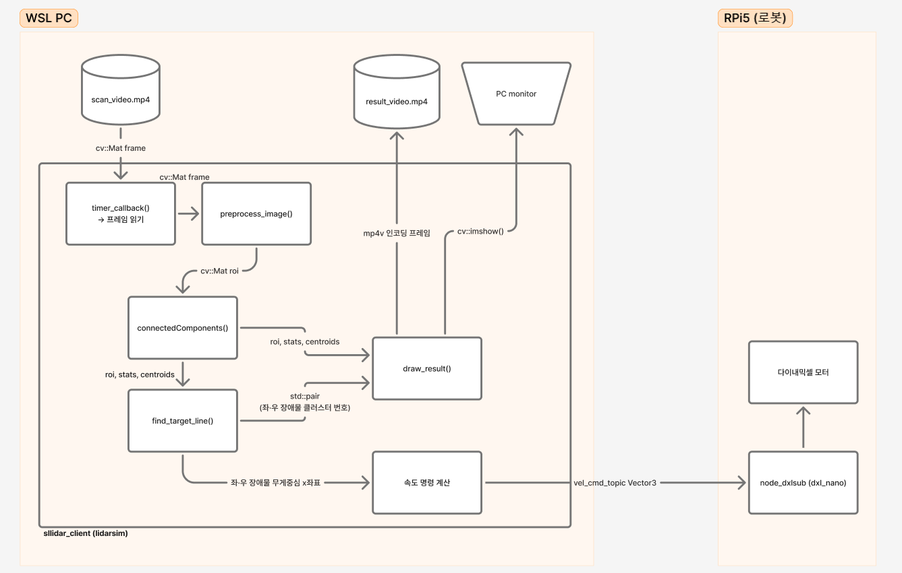
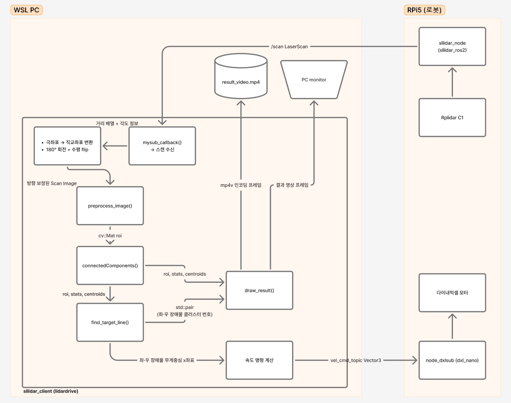

# 30_ROS2 장애물 회피 주행 발표

## 전체 시스템 구성

### 프로젝트 개요

본 프로젝트는 LIDAR 센서를 활용한 **장애물 회피 자율주행 시스템** 구현을 목표로 한다. 총 3단계의 실습 과제로 구성되며, 각 단계는 이전 단계의 결과물을 기반으로 발전시키는 구조다.

- **과제 1** : 로봇을 키보드로 원격 조종하며 LIDAR 스캔 영상을 MP4로 저장
- **과제 2** : 저장된 영상을 재생하며 장애물 회피 알고리즘을 시뮬레이션으로 검증
- **과제 3** : 검증된 알고리즘을 실제 LIDAR와 연결하여 자율 장애물 회피 주행 구현

RPi5 보드(로봇)와 WSL PC(알고리즘 처리) 2개의 PC가 동일 네트워크에서 ROS2 토픽으로 통신한다. 네트워크는 Bridge 모드를 사용하며, Windows PC는 이더넷, WSL2와 RPi5는 Wi-Fi로 연결된다.

---

### 하드웨어 사양

| 항목 | RPi5 (로봇) | WSL PC |
|------|------------|--------|
| **보드 / OS** | Raspberry Pi 5 / Ubuntu 24.04 | Windows 11 / WSL2 Ubuntu 24.04 |
| **ROS2** | Jazzy | Jazzy |
| **LIDAR** | SLAMTEC Rplidar C1 | — |
| **카메라** | IMX219 (Raspberry Pi Camera v2) | — |
| **모터** | 다이내믹셀 MX-12W | — |
| **통신** | Wi-Fi | Wi-Fi (WSL2 Bridge) |

---

### ROS2 토픽 구성

| 토픽 | 메시지 타입 | 발행 노드 | 구독 노드 |
|------|------------|-----------|-----------|
| `/scan` | `sensor_msgs/LaserScan` | `sllidar_node` (RPi5) | `sllidar_client` (WSL) |
| `vel_cmd_topic` | `geometry_msgs/Vector3` | `sllidar_client` (WSL) | `node_dxlsub` (RPi5) |

---

## 실습 과제 1 — LIDAR 스캔 영상 저장 (lidarsave)

> 키보드로 로봇을 원격제어하면서 LIDAR 스캔 영상을 MP4로 저장

### 블록도



### 노드 구성

| 노드 | 패키지 | 실행 PC | 역할 |
|------|--------|---------|------|
| `sllidar_node` | [src/sllidar_ros2/src](../src/sllidar_ros2/src) | RPi5 | LIDAR 스캔 데이터 발행 |
| `node_dxlsub` | dxl_nano | RPi5 | 속도 명령 수신 → 모터 구동 |
| `scanCb` (lidarsave) | [src/lidarsave](../src/lidarsave) | WSL | 스캔 시각화 및 영상 저장 |
| `node_dxlpub` | [src/dxl_wsl](../src/dxl_wsl) | WSL | 키보드 입력 → 속도 명령 발행 |

---

### 코드 설명

#### `sllidar_node` — LIDAR 스캔 발행 (RPi5)

```
[LIDAR 센서] → [sllidar_node] → /scan (LaserScan)
```

- LIDAR 하드웨어에서 측정한 360° 거리 데이터를 `sensor_msgs/LaserScan` 메시지로 변환하여 발행
- 발행 주기: **10Hz**

---

#### `scanCb()` — 스캔 수신 및 영상 저장 (lidarsave, WSL)

```
/scan (LaserScan) → [scanCb] → 화면 출력 + scan_video.mp4 저장
```

**① 스캔 포인트 개수 확인**
```cpp
int count = scan->scan_time / scan->time_increment;
if(scan->ranges.size() > 0) count = scan->ranges.size(); // 실제 데이터 크기로 보정
```

**② 500×500 스캔 영상 생성**
```cpp
cv::Mat image(500, 500, CV_8UC3, cv::Scalar(255, 255, 255)); // 흰색 배경
// 중심(250,250) = 로봇 위치, 십자 표시
cv::line(image, cv::Point(250,245), cv::Point(250,255), cv::Scalar(0,0,0), 1);
cv::line(image, cv::Point(245,250), cv::Point(255,250), cv::Scalar(0,0,0), 1);
```

**③ 극좌표 → 직교좌표 변환**
```cpp
double scale = 100.0; // 1m = 100px → 최대 표시 거리 2.5m

int x = 250 + (int)(distance * scale * sin(angle_rad));
int y = 250 + (int)(distance * scale * cos(angle_rad));
cv::circle(image, cv::Point(x,y), 2, cv::Scalar(0,0,255), -1); // 빨간 점
```

**④ 동영상 저장 (첫 프레임에서 초기화)**
```cpp
if (!is_video_init) {
    video_writer.open(".../ros2_basic_30_test1.mp4",
                      cv::VideoWriter::fourcc('M','J','P','G'), 10, cv::Size(500,500));
    is_video_init = true;
}
video_writer.write(image);
```

---

#### `node_dxlpub` — 키보드 원격제어 (dxl_wsl, WSL)

```
⌨️ 키보드 입력 → [node_dxlpub] → vel_cmd_topic (Vector3)
```

**키 입력 → 목표 속도 매핑**

| 키 | 동작 | 왼쪽 바퀴 (vel.x) | 오른쪽 바퀴 (vel.y) |
|----|------|-------------------|---------------------|
| `f` | 전진 | +50 rpm | -50 rpm |
| `b` | 후진 | -50 rpm | +50 rpm |
| `l` | 좌회전 | -50 rpm | -50 rpm |
| `r` | 우회전 | +50 rpm | +50 rpm |
| `s` / `space` | 정지 | 0 | 0 |

---
### 실행 결과
[video](https://github.com/user-attachments/assets/a6c6184c-cda9-4e1e-ac36-c3eea237ea5b)
---

## 실습 과제 2 — 시뮬레이션 장애물 회피 (lidarsim)

> 과제 1에서 저장한 영상으로 장애물 회피 알고리즘을 시뮬레이션

### 블록도



### 노드 구성

| 노드 | 패키지 | 실행 PC | 역할 |
|------|--------|---------|------|
| `sllidar_client` (lidarsim) | [src/lidarsim](../src/lidarsim) | WSL | 영상 읽기 → 장애물 탐지 → 속도 명령 발행 |
| `node_dxlsub` | dxl_nano | RPi5 | 속도 명령 수신 → 모터 구동 |

> 실제 LIDAR 없이 저장된 영상만으로 알고리즘 검증 가능

---

### 코드 설명

#### `timer_callback()` — 메인 처리 루프 (100ms)

```
scan_video.mp4 → 프레임 읽기 → 전처리 → 장애물 탐지 → 속도 계산 → vel_cmd_topic
```

**① 프레임 읽기**
```cpp
cv::Mat frame;
cap_ >> frame; // 동영상에서 한 프레임 읽기 (10fps = 100ms 주기와 동기화)
if (frame.empty()) {
    cap_.set(cv::CAP_PROP_POS_FRAMES, 0); // 끝나면 처음으로 반복
    return;
}
```

---

#### `preprocess_image()` — 이진화 및 ROI 추출

```
BGR 프레임 → 그레이스케일 → 이진화(반전) → 상단 절반 ROI
```

```cpp
cv::cvtColor(result, gray, cv::COLOR_BGR2GRAY);
cv::threshold(gray, binary, 120, 255, cv::THRESH_BINARY_INV);
// 장애물(어두운 픽셀) → 255, 빈 공간(흰색) → 0
return binary(cv::Rect(0, 0, 500, 250)); // 로봇 전방(상단 절반)만 분석
```

---

#### `find_target_line()` — 장애물 클러스터 탐색

```
ROI 이진 영상 + connectedComponents 결과 → (left_idx, right_idx)
```

```cpp
cv::Point robot_pos(250, 250); // 화면 중심 = 로봇 위치

for (int i = 1; i < cnt; i++) {
    if (stats.at<int>(i, 4) < 5) continue;  // 5px 미만 노이즈 제거
    if (dist < 10.0) continue;              // 너무 가까운 점 제거

    if (cx < 250) // 화면 왼쪽 → 좌측 장애물
        { if (dist < min_dist_l) { l_idx = i; } }
    else         // 화면 오른쪽 → 우측 장애물
        { if (dist < min_dist_r) { r_idx = i; } }
}
```

**미탐지 시 기본값**

| 방향 | 미탐지 기본값 | 효과 |
|------|--------------|------|
| 좌측 | (50, 50) | 좌측 구석 — 우측 회피 유도 |
| 우측 | (450, 50) | 우측 구석 — 좌측 회피 유도 |

---

#### `draw_result()` — 시각화

```
화살표로 장애물 방향과 목표 방향 표시
```

| 색상 | 의미 |
|------|------|
| 초록 화살표 | 로봇 → 좌측 장애물 |
| 빨간 화살표 | 로봇 → 우측 장애물 |
| 파란 화살표 | 로봇 → 목표 방향 (좌·우 중간) |

---

#### 속도 명령 계산

```
error = 250 - (left_x + right_x) / 2
vel.x = 50 - k * error   (왼쪽 바퀴)
vel.y = -(50 + k * error) (오른쪽 바퀴)
```

| 상황 | error | 결과 |
|------|-------|------|
| 장애물이 좌측에 치우침 | 양수(+) | 왼쪽 감속, 오른쪽 가속 → 좌회전 |
| 장애물이 우측에 치우침 | 음수(-) | 왼쪽 가속, 오른쪽 감속 → 우회전 |
| 장애물이 정중앙 | 0 | 직진 |

- 게인 `k = 1.5`
- `s` 키: 주행 시작 / `q` 키: 정지

---
### 실행 결과
[video](https://github.com/user-attachments/assets/93ce2e94-8f77-42c6-ad41-b0ea7787e145)
---


## 실습 과제 3 — 실제 장애물 회피 주행 (lidardrive)

> 실제 LIDAR 데이터를 실시간으로 처리하여 장애물 사이를 자율 주행

### 블록도



### 노드 구성

| 노드 | 패키지 | 실행 PC | 역할 |
|------|--------|---------|------|
| `sllidar_node` | [src/sllidar_ros2/src](../src/sllidar_ros2/src) | RPi5 | LIDAR 스캔 발행 |
| `node_dxlsub` | dxl_nano | RPi5 | 속도 명령 수신 → 모터 구동 |
| `sllidar_client` (lidardrive) | [src/lidardrive](../src/lidardrive) | WSL | 스캔 수신 → 장애물 탐지 → 속도 명령 발행 |

> lidarsim과 달리 타이머 없이 `/scan` 콜백에서 직접 처리 (LIDAR 주기 = 10Hz)

---

### 코드 설명

#### `mysub_callback()` — 스캔 수신 및 처리

```
/scan (LaserScan) → 스캔 이미지 생성 → 방향 보정 → 장애물 탐지 → 속도 명령
```

**① 스캔 → 이미지 변환**
```cpp
float scale = 8.0; // 표시 범위: 1m ≈ 80px, 최대 약 3.1m

float x = 250 + scan->ranges[i] * (10.0*scale) * sin(angle);
float y = 250 - scan->ranges[i] * (10.0*scale) * cos(angle);
cv::circle(scan_video, cv::Point(x,y), 1, cv::Scalar(0,0,255), -1);
```

**② 방향 보정 (lidardrive 고유 처리)**

lidarsave와 달리 LIDAR 좌표계와 이미지 좌표계 차이를 보정한다.

```cpp
// 180° 회전 후 좌우 반전 → 이미지 상단 = 로봇 전방
cv::Mat rotate = cv::getRotationMatrix2D(cv::Point(250,250), 180, 1);
cv::warpAffine(scan_video, result, rotate, scan_video.size());
cv::flip(result, result, 1);
```

---

#### `preprocess_image()` — 이진화 및 ROI 추출

```cpp
cv::threshold(gray, binary, 100, 255, cv::THRESH_BINARY_INV);
// 임계값 100 (lidarsim은 120) — 더 민감하게 장애물 검출
return binary(cv::Rect(0, 0, 500, 250)); // 상단 절반 ROI
```

---

#### `find_target_line()` — 장애물 탐색

```cpp
cv::Point robot_pos(250, 250);

for (int i = 1; i < cnt; i++) {
    int cx = cvRound(centroids.at<double>(i, 0));
    int cy = cvRound(centroids.at<double>(i, 1));
    double dist = cv::norm(robot_pos - cv::Point(cx, cy));

    if (cx < 250) {  // 화면 왼쪽 절반 → 좌측 장애물
        if (dist < min_dist_l) { min_dist_l = dist; l_idx = i; }
    } else {         // 화면 오른쪽 절반 → 우측 장애물
        if (dist < min_dist_r) { min_dist_r = dist; r_idx = i; }
    }
}
```

- `cx < 250` 기준으로 좌·우 장애물을 분류
- 각 방향에서 로봇 중심과 **가장 가까운 클러스터** 하나씩 선택
- 장애물이 탐지되지 않으면 기본값 적용

| 방향 | 미탐지 기본값 | 효과 |
|------|--------------|------|
| 좌측 | `(0, 0)` | 화면 좌측 끝으로 설정 → 통로 중심이 자동으로 우측을 향함 |
| 우측 | `(500, 0)` | 화면 우측 끝으로 설정 → 통로 중심이 자동으로 좌측을 향함 |

---

#### `draw_result()` — 시각화

```cpp
cv::Point robot_pos(250, 250);

// 탐지된 클러스터에 바운딩 박스와 중심점 표시
cv::rectangle(result, cv::Rect(left, top, width, height), color, 2);
cv::circle(result, cv::Point(cx, cy), 3, color, -1);

// 좌측 장애물: 로봇 → 바운딩 박스 우하단 꼭짓점으로 초록 화살표
cv::Point l_box_bottom_right(left + width, top + height);
cv::arrowedLine(result, robot_pos, l_box_bottom_right, cv::Scalar(0, 255, 0), 1);

// 우측 장애물: 로봇 → 바운딩 박스 좌하단 꼭짓점으로 빨간 화살표
cv::Point r_box_bottom_left(left, top + height);
cv::arrowedLine(result, robot_pos, r_box_bottom_left, cv::Scalar(0, 0, 255), 1);

// 로봇 → 좌·우 무게중심 중간점으로 파란 화살표 (목표 방향)
int target_x = (tmp_pt_l.x + tmp_pt_r.x) / 2;
cv::arrowedLine(result, robot_pos, cv::Point(target_x, 100), cv::Scalar(255, 0, 0), 1);
```

| 색상 | 대상 | 화살표 목표 |
|------|------|------------|
| 초록 | 좌측 장애물 | 바운딩 박스 우하단 |
| 빨간 | 우측 장애물 | 바운딩 박스 좌하단 |
| 파란 | 목표 방향 | 좌·우 무게중심 중간점 |

---

#### 속도 명령 계산

```cpp
int error = 250 - ((tmp_pt_l.x + tmp_pt_r.x) / 2);
```

- `(tmp_pt_l.x + tmp_pt_r.x) / 2` : 좌·우 장애물 무게중심의 중간점 = 통로 중심의 x 좌표
- `error` : 화면 중심(250)에서 통로 중심이 얼마나 벗어났는지

```cpp
if (error == 0 || error < -60 || error > 60) {
    vel.x = 50;   // 왼쪽 바퀴
    vel.y = -50;  // 오른쪽 바퀴 (직진)
} else {
    vel.x = 50 - k * error;    // 왼쪽 바퀴
    vel.y = -(50 + k * error); // 오른쪽 바퀴
}
```

| 조건 | 동작 |
|------|------|
| `error == 0` | 통로 중심이 화면 정중앙 → 직진 |
| `-60 ≤ error ≤ 60` | 통로 방향으로 비례 조향 (게인 `k = 0.45`) |

**비례 조향 동작:**
- `error > 0` (통로가 좌측) : 왼쪽 바퀴 감속, 오른쪽 바퀴 가속 → 좌회전
- `error < 0` (통로가 우측) : 왼쪽 바퀴 가속, 오른쪽 바퀴 감속 → 우회전

- `s` 키: 주행 시작 / `q` 키: 정지

---

### 실행 결과
→ Terminal Video

[video](https://github.com/user-attachments/assets/44690444-04f3-4ae1-b4a0-f4e53207c532)

→ Robot_View and Draw LiDAR Data for OpenCV
 
[robot_view](https://github.com/user-attachments/assets/330b7746-32f1-4ec0-97ad-69e61695613f)

→ Human_View

[human_view](https://github.com/user-attachments/assets/4ffc8c2b-4a06-4cf9-bb65-56af8d2e6edd)
